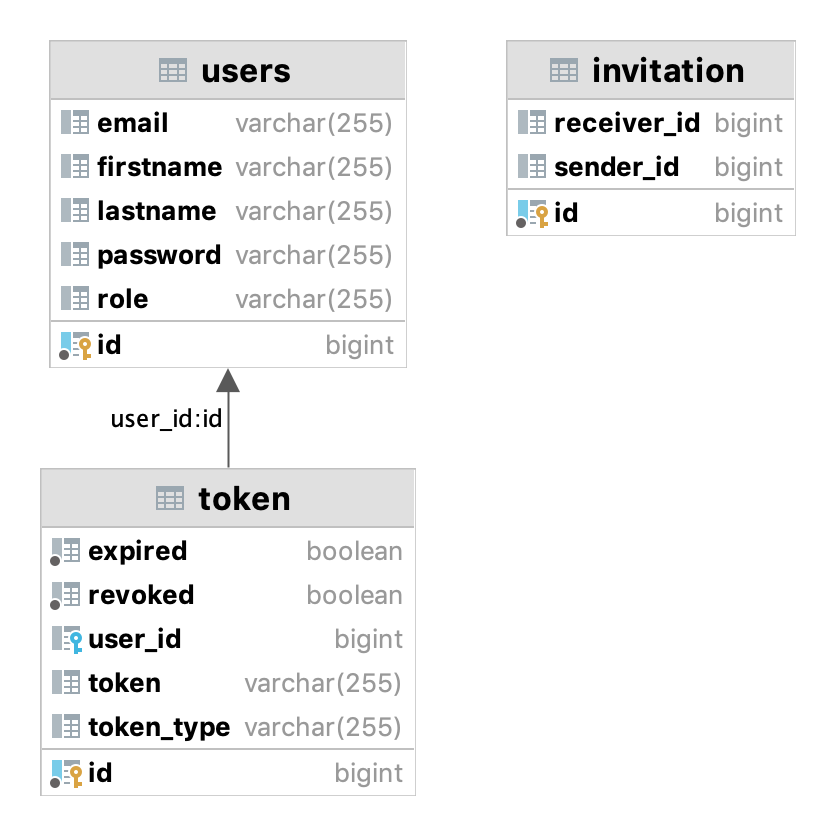
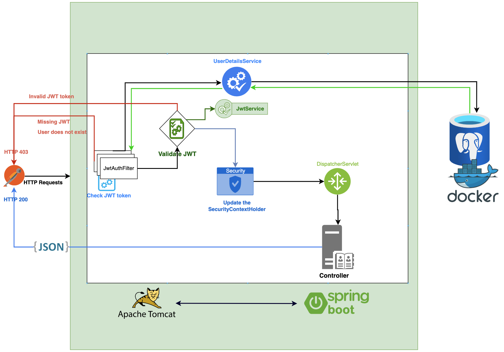

# Book-me Application

## 1. [Overview](#overview)
- [Goal to Learn](#goal-to-learn)
- [Technologies Used](#technologies-used)

## 2. [Modules](#modules)
- [User-service](#user-service)
- [Invitation-service](#invitation-service)
- [Discovery-server](#discovery-server)
- [API Gateway](#api-gateway)
- [Config Server](#config-server)

## 3. [Security Layer](#security-layer)
- [Application Config](#application-config)
- [JwtAuthenticationFilter](#jwtauthenticationfilter)
- [Security Configuration](#security-configuration)
- [AuthenticationService Documentation](#authenticationservice)
- [JwtService Documentation](#jwtservice)
- [LogoutService Documentation](#logoutservice)

## 4. [Summary](#summary)

## Overview
The project is a microservices-based application designed to facilitate user invitations via email. It employs a set of modern technologies for microservices communication, service discovery, configuration management, and tracking service interactions. The development process included learning and implementing technologies such as Open Feign, Eureka, Config Server, Zipkin, and Docker.
## Goal to learn
The main goal was to create a microservice and learn how to facilitate communication between different services.
I studied the following technologies during the development:

1. **Open Feign**: for communication between services.
2. **Eureka**: for service discovery.
3. **Config Server**: for configuring services.
4. **Zipkin**: for tracking traffic between services.
5. **Docker**: for deploying the database and Zipkin.

## Technologies Used
- *JWT (JSON Web Token)*
- *Spring Boot Starter Security*
- *Spring Cloud*
- *Docker*
- *Spring Boot Starter Web*
- *Spring Data JPA*
- *PostgreSQL Driver*
- *Project Lombok*
- *Spring Boot Starter Test*
- *JUnit Jupiter*
- *Java 17*

# Modules
## User-service: 

The `user-service` module serves as the security layer within the application, addressing key functionalities related to user management. The objectives of the `user-service` include:

- **JWT Token Generation**:
    Users are provided with a JWT token, ensuring secure authentication within the application.

- **Token Refresh Mechanism**:
   The user's token is automatically refreshed after a designated period, enhancing security and session continuity.

- **Password Modification**:
   Users can change their passwords, contributing to the overall security and customization of account credentials.
- **Logout Functionality**:
   A logout feature is implemented, allowing users to terminate their sessions securely.

The primary responsibilities of the `user-service` module include the creation and management of user-related actions. Notably, it houses the critical security layer of the application, ensuring a robust and secure environment for user interactions.

This module plays a pivotal role in handling user-related functionalities and maintaining the integrity of the security layer throughout the application.

# User-Service Configuration

The `ApplicationConfig` class in the `user-service` module serves as a configuration file responsible for defining key components related to user authentication and security.

## Components and Configuration

### 1. `userDetailsService()`

- **Purpose**: Creates an implementation of the `UserDetailsService` interface.
- **Description**: Retrieves user details from the `UserRepository` based on the provided username (email).
- **Return Type**: `UserDetailsService`
- **Usage**: Used for authenticating users during the login process.

### 2. `authenticationProvider()`

- **Purpose**: Configures and provides an instance of `DaoAuthenticationProvider`.
- **Description**: Sets up the authentication provider with the custom `UserDetailsService` and a password encoder.
- **Return Type**: `AuthenticationProvider`
- **Usage**: Integrated into the authentication process to verify user credentials.

### 3. `authenticationManager()`

- **Purpose**: Creates an instance of `AuthenticationManager`.
- **Description**: Obtains the `AuthenticationManager` from the Spring Security configuration.
- **Return Type**: `AuthenticationManager`
- **Usage**: Required for managing the authentication process, such as validating user credentials.

### 4. `passwordEncoder()`

- **Purpose**: Defines a `PasswordEncoder` bean.
- **Description**: Utilizes the BCryptPasswordEncoder for securely encoding and decoding passwords.
- **Return Type**: `PasswordEncoder`
- **Usage**: Employed during user registration and authentication to ensure password security.

## Usage

This configuration is essential for establishing the authentication and security mechanisms within the `user-service` module. It integrates with Spring Security to authenticate users based on their credentials stored in the database and ensures secure password handling through encryption.

## Dependencies

- **Lombok**: Used for reducing boilerplate code.
- **Spring Security**: Provides comprehensive security services for the Spring framework.
- **Spring Data JPA**: Simplifies data access and persistence for the user repository.

**Note:** Ensure that the required dependencies are included in the project's build file for proper functionality.

## Invitation-service

The `invitation-service` module is responsible for the creation and management of invitations within the application. Key features of the `invitation-service` include:

 - **Invitation Lifecycle Management**:
 The module oversees the entire lifecycle of invitations, handling creation and related actions.

 - **Interaction with `user-service` via FeignClient**:
   `invitation-service` seamlessly interacts with the `user-service` module through a FeignClient. This collaboration ensures efficient communication and integration between the two services.

The primary focus of the `invitation-service` is to manage the invitation processes within the application. Its capability to interact with the `user-service` through FeignClient enhances the overall functionality and coordination between the modules. This module contributes significantly to the user-invitation dynamics in the broader context of the application.

## Discovery-server
The `discovery-server` module serves as the Eureka load balancer, providing a centralized hub that displays our core services. Key features of the `discovery-server` include:

   - **Eureka Load Balancer**:
The module acts as a load balancer for Eureka, efficiently distributing and managing the traffic among our primary services.

   - **Service Visibility**:
       The `discovery-server` offers a consolidated view of our essential services, providing visibility into their availability and health.

The primary role of the `discovery-server` is to act as the Eureka load balancer, ensuring optimal distribution of requests among the registered services. Additionally, it serves as a central point for monitoring and observing the status of our core services within the application architecture.

## API Gateway

The `api-gateway` module serves as the central entry point for all requests within the application. Key features of the `api-gateway` include:

 - **Single Entry Point**:
 The module consolidates all incoming requests, providing a unified and singular entry point for communication with the application.

The primary role of the `api-gateway` is to streamline and channelize external requests, serving as a centralized gateway for interactions with various modules within the application architecture. This module acts as a critical component in managing the entry and routing of requests, ensuring efficient communication throughout the system.

## Config Server

The `config-server` module is responsible for managing the configurations of various modules within the application. Key features of the `config-server` include:

- **Configuration Management**:
The module handles the centralization and management of configurations for individual modules within the application.

The primary function of the `config-server` is to ensure a centralized and organized approach to handling configurations, facilitating easy updates and maintenance across different modules. This module plays a crucial role in maintaining consistency and coherence in the configuration settings throughout the application architecture.

# Security layer

## _Application Config_

The `ApplicationConfig` class in the `user-service` module serves as a configuration file responsible for defining key components related to user authentication and security.

### 1. `userDetailsService()`

- **Purpose**: Creates an implementation of the `UserDetailsService` interface.
- **Description**: Retrieves user details from the `UserRepository` based on the provided username (email).
- **Return Type**: `UserDetailsService`
- **Usage**: Used for authenticating users during the login process.

### 2. `authenticationProvider()`

- **Purpose**: Configures and provides an instance of `DaoAuthenticationProvider`.
- **Description**: Sets up the authentication provider with the custom `UserDetailsService` and a password encoder.
- **Return Type**: `AuthenticationProvider`
- **Usage**: Integrated into the authentication process to verify user credentials.

### 3. `authenticationManager()`

- **Purpose**: Creates an instance of `AuthenticationManager`.
- **Description**: Obtains the `AuthenticationManager` from the Spring Security configuration.
- **Return Type**: `AuthenticationManager`
- **Usage**: Required for managing the authentication process, such as validating user credentials.

### 4. `passwordEncoder()`

- **Purpose**: Defines a `PasswordEncoder` bean.
- **Description**: Utilizes the BCryptPasswordEncoder for securely encoding and decoding passwords.
- **Return Type**: `PasswordEncoder`
- **Usage**: Employed during user registration and authentication to ensure password security.

### Usage

This configuration is essential for establishing the authentication and security mechanisms within the `user-service` module. It integrates with Spring Security to authenticate users based on their credentials stored in the database and ensures secure password handling through encryption.

## _JwtAuthenticationFilter_

The `JwtAuthenticationFilter` class in the `user-service` module is a filter responsible for processing JWT (JSON Web Token) authentication. This filter is applied to every HTTP request and performs the following key functionalities:

1. **Token Validation**: Checks the validity of the JWT token included in the request's Authorization header.

2. **User Authentication**: Authenticates the user based on the information extracted from the JWT token.

3. **Token Expiry and Revocation Check**: Ensures that the token is not expired and has not been revoked.

4. **Integration with Spring Security**: Integrates with Spring Security to establish the user's authentication context.

## Components and Functions

###  `doFilterInternal()`

- **Purpose**: Executes the filter logic for each incoming HTTP request.
- **Parameters**:
    - `HttpServletRequest request`: The incoming HTTP request.
    - `HttpServletResponse response`: The HTTP response to be sent.
    - `FilterChain filterChain`: Chain of filters to be executed.

- **Flow**:
    1. Extracts the JWT token from the Authorization header.
    2. Checks if the token is present and starts with "Bearer ".
    3. Extracts the user's email from the JWT token.
    4. Validates the token's authenticity and checks if the user is not already authenticated.
    5. Verifies the token's validity and user's existence in the database.
    6. Checks if the token is not expired and has not been revoked.
    7. Authenticates the user and sets the authentication details in the Spring Security context.
    8. Continues the filter chain.

### Usage

This filter is automatically applied to every incoming request as part of the security configuration. It plays a crucial role in authenticating users based on JWT tokens and enhancing the overall security of the application.

## _Security Configuration_

The `SecurityConfig` class in the `user-service` module is responsible for configuring security settings within the application. It defines the security filter chain, authentication provider, and filters to control access and handle authentication processes.

## Components and Configuration

### `securityFilterChain()`

- **Purpose**: Defines the security filter chain for processing incoming HTTP requests.
- **Parameters**:
    - `HttpSecurity httpSecurity`: The HTTP security configuration object.
- **Configuration**:
    - Disables Cross-Site Request Forgery (CSRF) protection.
    - Permits unauthenticated access to specified API endpoints and Swagger documentation.
    - Requires authentication for all other requests.
    - Configures stateless session management.
    - Integrates custom `JwtAuthenticationFilter` before the default `UsernamePasswordAuthenticationFilter`.
    - Configures logout functionality, including URL, logout handler, and success handler.

## Usage

This configuration is essential for establishing security measures within the `user-service` module. It controls access to various API endpoints, manages user authentication through JWT tokens, and configures session handling.

## _AuthenticationService_

The `AuthenticationService` class in the `user-service` module is responsible for managing user authentication, registration, and token-related operations. It provides functionalities to register new users, authenticate existing users, and handle token refresh.

## Key Functionalities

### 1. `register(RegisterRequest request)`

- **Purpose**: Registers a new user in the system.
- **Parameters**:
    - `RegisterRequest request`: User registration request containing user details.

- **Flow**:
    1. Creates a new `User` entity with the provided registration details.
    2. Encodes the user's password using the configured `PasswordEncoder`.
    3. Saves the user to the database.
    4. Generates an access token and a refresh token using the `JwtService`.
    5. Saves the user's token to the `TokenRepository`.
    6. Returns an `AuthenticationResponse` containing the access and refresh tokens.

### 2. `authenticate(AuthenticationRequest request)`

- **Purpose**: Authenticates an existing user.
- **Parameters**:
    - `AuthenticationRequest request`: User authentication request containing email and password.
- **Flow**:
    1. Authenticates the user using the configured `AuthenticationManager`.
    2. Retrieves the user from the database based on the provided email.
    3. Generates an access token and a refresh token using the `JwtService`.
    4. Revokes all existing valid tokens for the user.
    5. Saves the user's new token to the `TokenRepository`.
    6. Returns an `AuthenticationResponse` containing the new access and refresh tokens.

### 3. `refreshToken(HttpServletRequest request, HttpServletResponse response)`

- **Purpose**: Refreshes the user's access token using a valid refresh token.
- **Parameters**:
    - `HttpServletRequest request`: HTTP request containing the refresh token.
    - `HttpServletResponse response`: HTTP response where the new tokens will be written.
- **Flow**:
    1. Extracts the refresh token from the Authorization header.
    2. Retrieves the user's email from the refresh token.
    3. Checks if the user is authenticated and the refresh token is valid.
    4. Generates a new access token and revokes all existing valid tokens for the user.
    5. Saves the user's new token to the `TokenRepository`.
    6. Writes the new access and refresh tokens to the HTTP response.

## Usage

The `AuthenticationService` is a crucial component for user authentication and registration within the `user-service` module. It interfaces with Spring Security, JwtService, and the database to provide secure and efficient authentication processes. The token refresh functionality enhances the overall security and user experience by seamlessly generating new access tokens.

# _JwtService_

The `JwtService` class in the `user-service` module provides functionality for generating, validating, and extracting information from JSON Web Tokens (JWTs). This service is integral to user authentication and token management within the application.

## Key Features

### 1. Token Generation

- **Purpose**: Generates JWTs for user authentication and refresh.
- **Methods**:
    - `generateToken(Map<String, Object> extraClaims, UserDetails userDetails)`: Generates an access token with optional extra claims.
    - `generateRefreshToken(UserDetails userDetails)`: Generates a refresh token.

### 2. Token Validation

- **Purpose**: Validates the integrity and expiration of JWTs.
- **Methods**:
    - `isTokenValid(String token, UserDetails userDetails)`: Checks if a token is valid for a given user.
    - `isTokenExpired(String token)`: Checks if a token has expired.

### 3. Token Extraction

- **Purpose**: Extracts information, such as username and expiration, from JWTs.
- **Methods**:
    - `extractUsername(String token)`: Extracts the username from a JWT.
    - `extractExpiration(String token)`: Extracts the expiration date from a JWT.
    - `extractAllClaims(String token)`: Extracts all claims (payload) from a JWT.

### 4. Key Management

- **Purpose**: Manages the secret key used for signing JWTs.
- **Methods**:
    - `getSignInKey()`: Retrieves the signing key.

## Configuration Properties

- `secretKey`: The secret key used for signing JWTs.
- `jwtExpiration`: The expiration time (in milliseconds) for access tokens.
- `refreshExpiration`: The expiration time (in milliseconds) for refresh tokens.

## Usage

The `JwtService` is a crucial component for handling JWT-related operations in the `user-service` module. It integrates with Spring Security, providing secure authentication through JWTs. This service encapsulates the complexities of JWT creation, validation, and key management.

## _LogoutService_

The `LogoutService` class in the `user-service` module implements the Spring Security `LogoutHandler` interface and provides functionality to handle user logout by invalidating and revoking JWT tokens associated with the user.

## Key Features

### 1. Logout Handling

- **Purpose**: Invalidates and revokes JWT tokens upon user logout.
- **Method**:
    - `logout(HttpServletRequest request, HttpServletResponse response, Authentication authentication)`: Implements the `LogoutHandler` interface to handle user logout.

### 2. Token Invalidation

- **Purpose**: Marks the user's JWT token as expired and revoked in the database upon logout.
- **Flow**:
    1. Extracts the JWT token from the Authorization header in the HTTP request.
    2. Retrieves the token information from the `TokenRepository`.
    3. Marks the token as expired and revoked.
    4. Saves the updated token information to the database.

## Usage

The `LogoutService` is integrated into the Spring Security authentication process as a `LogoutHandler`. It ensures that when a user logs out, their associated JWT token is properly invalidated and marked as revoked in the database. This contributes to the security of the application by preventing the use of invalidated tokens.

# Summary
In summary, this project has improved my skill at microservices architecture, cloud-native technologies, security implementation, testing methodologies, and more. These skills are valuable for building scalable, secure, and maintainable applications in modern software development.# book-me-backend
# book-me-backend
